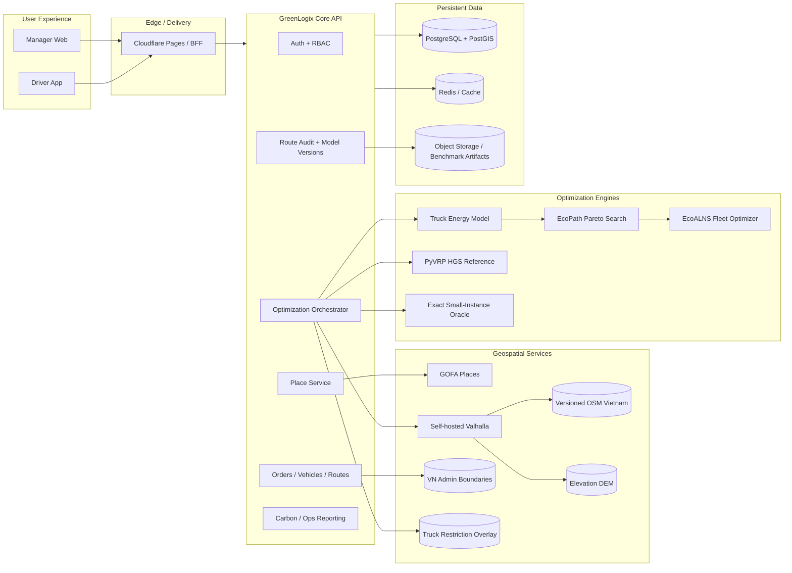

# GREENLOGIX / EcoMiles — Frontier Product & Engineering Plan

**Plan date:** 2026-09-21 (Asia/Ho_Chi_Minh)  
**Soft demo deadline:** 2026-09-24  
**Primary repository:** `ShayNeeo/RND_to_Startup_2026`  
**Analyzed snapshot:** `so2026` branch / uploaded repository snapshot  
**Product focus:** Vietnam urban truck routing, fleet sequencing, address correctness, eco/fuel optimization, driver execution  
**Planning principle:** the 24/09 deadline is a demo checkpoint, **not** the architecture ceiling.

---

# 0. Executive decision

GreenLogix should **not** position itself as “another Google Maps” and should **not** try to win by inventing a new shortest-path algorithm in isolation.

The defensible product is a layered system:

1. **Vietnam place resolution** — GOFA Places for human address search and canonical coordinates.
2. **Open, reproducible road graph** — self-hosted OpenStreetMap + Valhalla for truck-aware road feasibility and turn-by-turn geometry.
3. **GreenLogix Truck Constraint Layer** — versioned Vietnam-specific truck bans/restrictions, vehicle dimensions/weight, time-dependent rules, confidence/provenance.
4. **GreenLogix EcoRoute Engine** — estimates truck fuel/energy per road edge using speed, payload, road grade and stop/traffic effects; returns a Pareto set rather than mixing incomparable units.
5. **GreenLogix EcoFleet Engine** — assigns vehicles and orders and sequences stops using an eco-aware ALNS/HGS-style optimizer with capacity/time-window/truck-rule constraints.
6. **Execution layer** — Manager publishes route; Driver sees assigned route/stops/wards and one-click navigation. If handing off to Google Maps, explicitly launch `driving`, never rely on Google's inferred mode.
7. **Evidence layer** — benchmark every claim against public VRP benchmarks, exact small cases, hidden Vietnam cases, Google DRIVE routes, and eventually measured real-truck fuel/GPS telemetry.

## Critical correction to the original niche statement

The target is **truck drivers**, not motorcycles.

The current pain point is:

> A truck driver taps “Directions” in the current workflow; Google Maps can open in a motorcycle/two-wheeler context or another inferred/preferred mode; the driver must manually switch to driving. GreenLogix should remove that extra action and, more importantly, prevent the navigation handoff from silently discarding truck-specific route logic.

The immediate Flutter bug is visible in the repository:

```dart
'https://www.google.com/maps/dir/?api=1&destination=$lat,$lng'
```

It omits `travelmode=driving`. Google documents that if no travel mode is supplied, Maps chooses relevant modes based on the route and/or user preferences. Vietnam is explicitly supported for two-wheel routing.

**Immediate fix:**

```text
https://www.google.com/maps/dir/?api=1
  &destination=<lat>,<lng>
  &travelmode=driving
  &dir_action=navigate
```

This fixes the **mode-switch UX defect**. It does **not** make Google Maps a truck router. Google's large-vehicle routing is not currently available in Vietnam, so GreenLogix must not outsource truck legality to Google.

---

# 1. Current repository audit

## 1.1 Git state

At analysis time:

- Repository default branch: `dev`.
- `so2026` is **20 commits ahead of `dev` and 0 behind**.
- No open pull requests were present on GitHub at the time checked.
- The `so2026` branch contains the current road-baseline/eco work plus contest collateral.

The uploaded snapshot is therefore a sensible source for this plan, but the implementation should still follow the repository's `AGENTS.md` / change-request / branch rules.

## 1.2 What already exists and must be preserved

### FastAPI backend — `apps/api`

Current strengths:

- SQLModel persistence.
- Orders, vehicles, optimize, routes/publish, driver route/status, report endpoints.
- `RoadBaseline` abstraction.
- Valhalla `truck` matrix provider.
- OSRM driving fallback.
- Circuity fallback for test/demo.
- Matrix caching.
- Greedy clustering + capacity splitting + nearest-neighbor + 2-opt.
- CO2/fuel totals.
- Unit/API tests around road baseline and eco hook.

### Cloudflare Worker — `apps/worker`

Current strengths:

- Edge deployment path.
- D1-backed application logic.
- Mirror of road-baseline and solver behavior.

Current architectural problem:

- The Worker duplicates important domain/solver logic from FastAPI.
- Two implementations will diverge as soon as routing becomes serious.
- A Cloudflare Worker is not a good place to run a self-hosted Valhalla engine, PyVRP, ALNS, MILP oracle, map preprocessing, or larger benchmark workloads.

### Flutter driver app — `apps/mobile-driver`

Current strengths:

- Driver route list.
- Stop details.
- Arrived/delivered/fail workflow.
- External map handoff.

Current problem:

- Google directions URL does not specify `travelmode=driving`.
- External navigation can recompute a different route and therefore lose GreenLogix truck constraints.

### Current data model

`Vehicle` currently contains:

- plate
- type
- capacity_kg
- fuel
- l_per_100km
- status

This is not sufficient for reliable truck routing or physics-based fuel modeling.

`Order` stores free-text address and lat/lng but does not preserve:

- place provider;
- provider place ID;
- normalized address;
- geocode confidence;
- administrative codes;
- original vs snapped road coordinate.

`Route` stores aggregate km/litres/kgCO2 but no:

- duration;
- polyline;
- model version;
- road-data snapshot;
- restriction-data version;
- departure time;
- fuel-model provenance;
- comparison baseline;
- confidence tier.

---

# 2. Current code problems that must be fixed

These are not optional polish. They affect the validity of eco-routing claims.

## P-01 — Current “eco weight” is mathematically weak

Current code:

```python
(1 - w) * km + w * kg_co2
```

This directly adds **kilometres** to **kilograms of CO2**, which are different units.

Worse: for a fixed vehicle whose `L/100km` and fuel factor are constant,

```text
kgCO2 = constant × km
```

so `eco_weight=1` is still effectively another shortest-distance objective. It cannot discover a longer but lower-fuel road caused by grade, congestion, stop-start behavior, or payload.

### Required action

- Deprecate `GREENLOGIX_ECO_WEIGHT`.
- Do not “tune” the weight.
- Replace it with either:
  - a genuine fuel/energy objective; or
  - a Pareto/epsilon-constraint formulation where travel time is bounded and fuel is minimized.

## P-02 — “Road baseline” and “business baseline” are conflated

`RoadBaseline` means “road distance provider”, while `baseline` in solver output means “unoptimized spreadsheet order”. Google is also discussed as a “baseline”.

### Required action

Rename concepts explicitly:

- `RoadGraphProvider` / `RoadCostProvider`: Valhalla, OSRM.
- `OperationalBaseline`: current/manual/spreadsheet process.
- `ExternalBenchmarkRoute`: Google DRIVE.
- `ReferenceSolver`: PyVRP / OR-Tools / exact oracle.

Do not reuse “baseline” for all four.

## P-03 — Truck envelope is hard-coded

Current Valhalla request assumes roughly:

```text
height=2.4m
width=2.0m
length=5.2m
weight=3.5t
```

This is not a valid fleet model if actual vehicles differ.

### Required action

Every vehicle must carry a `TruckProfile` and routing cache keys must include that profile.

Minimum fields:

```text
vehicle_id
vehicle_class
height_m
width_m
length_m
gross_vehicle_weight_t
empty_weight_kg
max_payload_kg
axle_load_t?          # nullable initially
fuel_type
engine/powertrain_type
rated_l_per_100km     # fallback/reporting prior
emission_standard?    # optional
frontal_area_m2?      # physics model
cd?                   # physics model
rolling_resistance?   # physics model
```

## P-04 — Matrix cache key is unsafe for richer routing

Current key is effectively:

```text
provider_id + coordinates
```

It does not include vehicle dimensions, departure time, traffic snapshot, restriction overlay version, fuel-model version, or OSM graph version.

### Required action

Use a structured cache key:

```text
road_graph_version
provider
truck_profile_hash
departure_time_bucket
restriction_overlay_version
traffic_snapshot_id
cost_model_version
ordered_coordinate_hash
```

## P-05 — Silent circuity fallback can invalidate results

If Valhalla/OSRM fails, optimization can silently fall back to straight-line × 1.35.

That is acceptable for unit tests or a clearly labeled degraded demo. It is unacceptable for an investor-facing “truck-safe eco route”.

### Required action

Production behavior:

- `routing_quality = VERIFIED_GRAPH | DEGRADED | UNAVAILABLE`.
- Fail closed for publishable truck routes when the truck graph is unavailable.
- Circuity may only be used for test fixtures or explicitly labeled estimates.

## P-06 — Worker and FastAPI duplicate solver logic

The Worker currently duplicates clustering, 2-opt, eco weighting and road provider logic. It already has behavioral drift; e.g. its spreadsheet baseline uses an average L/100km and then applies the petrol factor even when the fleet can contain diesel vehicles.

### Required action

Make **FastAPI the optimization/domain source of truth**.

Cloudflare should become one of:

- static frontend + reverse proxy/BFF;
- auth/session edge gateway;
- cache for safe GETs.

Do not implement EcoALNS twice.

## P-07 — Demo authentication is not production RBAC

Current model:

- Manager/dispatcher: `Bearer DEMO`.
- Driver: global PIN `0000`.

### Required action

Add real tenant-scoped auth and roles. Details are in Section 12.

## P-08 — CORS wildcard

FastAPI currently allows `*` origins/methods/headers.

### Required action

- Explicit allowed frontend origins by environment.
- Credentials only when required.
- Separate demo configuration from production.

## P-09 — Time-window logic is not a real constraint model

Current routes carry `window_start/window_end`, but the core heuristic does not solve VRPTW rigorously.

### Required action

Time windows, service times and departure time must be first-class constraints in route evaluation.

## P-10 — Aggregate emissions are not enough for defensible eco-routing

Current fuel estimate:

```text
litres = distance × L/100km
```

This is acceptable as a basic accounting estimate but not an eco-path objective.

### Required action

Separate:

1. **optimization energy model** — used to choose roads/routes;
2. **reporting/accounting model** — used to report TTW/WTW CO2e with stated methodology.

---

# 3. Correct product problem formulation

The optimization problem has **two distinct levels**.

## Level A — Road/path routing between two stops

Given:

- origin;
- destination;
- departure time;
- truck dimensions and mass;
- current payload;
- road restrictions;
- expected speed/traffic;
- road grade;

find a truck-feasible path that minimizes expected fuel/energy subject to an acceptable arrival-time penalty.

This is **not** ordinary shortest path.

## Level B — Fleet routing across all orders

Given:

- depot(s);
- vehicles;
- capacities;
- order weights;
- time windows;
- service times;
- truck restrictions;
- Level-A path costs;

find:

- which vehicle serves which orders;
- in what stop order;
- which eco/fast path is selected for each leg;

while maintaining feasibility and minimizing fuel/CO2e and operational cost.

These two levels should have separate interfaces and benchmarks.

---

# 4. Target architecture



## Architecture decisions

### A. FastAPI is authoritative

Reason:

- Python ecosystem for PyVRP, OR-Tools/CP-SAT, scientific validation, geospatial tools and research prototypes.
- Easier integration of benchmark and calibration tooling.
- Long-running optimization jobs are more appropriate outside a Cloudflare Worker.

### B. PostgreSQL + PostGIS becomes production storage

SQLite stays for tests/local demo.

PostGIS is required for:

- route geometry;
- ward/commune intersection;
- restriction geometries;
- route corridor queries;
- spatial QA.

### C. Valhalla is self-hosted for production

Do not depend on public Valhalla/OSRM endpoints for production routing.

Build tiles from a pinned Vietnam OSM extract and store:

```text
osm_snapshot_id
osm_timestamp
valhalla_version
tile_build_hash
elevation_dataset_version
```

### D. OSM is the open reference substrate, not a perfect truth source

OSM is the most practical open/reproducible routing graph for Vietnam, but truck restriction completeness depends on tagging quality.

GreenLogix therefore needs its own restriction layer rather than claiming “OSM knows all Vietnam truck rules”.

---

# 5. GOFA Places integration — yes, implement it

## 5.1 Why GOFA fits this product

The sponsored entitlement supplied by the project owner is:

- 15,000 requests/month total;
- 10,000 Place AutoComplete;
- 5,000 Place Detail.

That is almost exactly what GreenLogix needs for the “address correctness” problem.

Use GOFA for:

- address/place search UX;
- choosing the intended place;
- canonical coordinates;
- possibly provider-supplied normalized address/admin metadata if the API returns them.

Do **not** assume the sponsorship includes GOFA routing, traffic, speed limits or HD-map endpoints. Public GOFA marketing describes those capabilities, but the supplied entitlement is specifically Places.

## 5.2 Provider abstraction

Create:

```python
class PlaceProvider(Protocol):
    async def autocomplete(self, query, *, bias=None, bounds=None, session_id=None) -> list[PlaceSuggestion]: ...
    async def detail(self, place_id: str) -> PlaceDetail: ...
```

Implement:

```text
GofaPlaceProvider
FallbackPlaceProvider      # optional self-hosted Photon/Pelias/Nominatim-derived service
```

Never call GOFA directly from Flutter/browser with the secret key.

## 5.3 Database fields

Add either a `places` table or fields on order/depot entities:

```text
place_provider
authoritative_place_id
input_text
normalized_address
lat
lng
admin_province_code
admin_commune_code
admin_label
geocode_confidence
resolved_at
provider_payload_hash
```

Preserve both:

- **address coordinate**: the actual POI/building coordinate;
- **road snap coordinate**: the feasible truck access point used for routing.

Do not overwrite the address coordinate with a snapped road coordinate.

## 5.4 Quota discipline

Autocomplete:

- debounce 250–350 ms;
- minimum 3 characters unless exact identifier;
- cancel stale in-flight request when the query changes;
- cache repeated query+bias combinations for a short TTL;
- cap displayed suggestions.

Detail:

- call only when the user selects a suggestion;
- cache by GOFA place ID under terms permitted by the sponsorship;
- do not call detail for every autocomplete result.

## 5.5 Required clarification from GOFA before production

The public web search did not expose a complete Places API contract. Obtain from GOFA:

- exact base URL and endpoint version;
- auth header/query format;
- request/second limits;
- location-bias and bounds support;
- response fields;
- session-token semantics if any;
- data retention/caching rights;
- attribution requirements;
- commercial use rights;
- whether coordinates/place detail may be stored long term;
- whether routing, traffic, speed-limit or road-sign APIs are available under an expanded sponsorship.

**Do not give the coding agent an API key in a prompt or commit.** Give it sanitized docs/schema only.

---

# 6. Vietnam administrative-route list: “đi qua phường nào”

This should be a real geospatial function, not inferred from delivery addresses.

Vietnam's administrative structure changed materially in 2025 and continues to receive updates. Therefore names must be versioned.

## 6.1 Data source strategy

Use:

1. official NSO/Government administrative codes/names as canonical labels;
2. a spatial geometry dataset (OSM boundaries or a licensed official geometry source) for polygon intersection;
3. record `admin_boundary_version` on route output.

Do not rely on pre-2025 district hierarchy.

## 6.2 Algorithm

For each route polyline:

1. transform to PostGIS `LINESTRING`;
2. spatially intersect with commune/ward polygons;
3. calculate length inside each polygon;
4. sort by first occurrence along the route;
5. merge repeated crossings if needed;
6. attach stops/packages in each administrative unit.

Example output:

```json
{
  "route_id": 144,
  "admin_boundary_version": "VN-2026-09-20",
  "areas": [
    {
      "code": "...",
      "name": "Phường ...",
      "distance_km": 4.8,
      "stop_ids": [91, 94]
    }
  ]
}
```

Driver UI:

```text
Tuyến 03 — Xe 29A-123.45
7 điểm giao · 31.6 km · ETA 2h18

Đi qua:
Thanh Xuân → Khương Đình → Hà Đông → Dương Nội

Packages:
1. #PKG-0081 — ... — 120 kg
2. #PKG-0023 — ... — 80 kg
...
```

---

# 7. Truck restriction layer — this is a major moat

## 7.1 Why not rely only on OSM

For a truck product, the following are safety/legality-critical:

- `hgv=no` / goods restrictions;
- max height;
- max width;
- max weight;
- max axle load;
- one-way;
- bridge/tunnel constraints;
- time-dependent truck bans;
- vehicle-class-specific urban restrictions;
- temporary closures.

OSM can encode many of these, but coverage varies.

## 7.2 `TruckRestriction` schema

```text
id
geometry / edge_refs
restriction_type
value
unit
vehicle_class_filter
active_schedule
valid_from
valid_to
source_type       # OSM | LAW | CITY_NOTICE | PARTNER | DRIVER_REPORT
source_reference
verified_at
verification_status
confidence
notes
```

## 7.3 Confidence model

Do not present all restrictions as equally certain.

```text
A = authoritative current legal/municipal source
B = verified map/operator source
C = trusted partner/driver report confirmed by second source
D = unverified user report
```

Route safety should expose:

```text
restriction_coverage = HIGH | MEDIUM | LOW
```

## 7.4 Driver feedback loop

Driver app must support:

- “Road closed for truck”;
- “Height/weight sign differs”;
- “Truck prohibited in this time window”;
- “Route impossible at this access point”.

Feedback creates a candidate restriction; it does **not** immediately mutate production routing until verified.

This data flywheel can become more defensible than the generic routing algorithm itself.

---

# 8. Eco-routing research direction

## 8.1 What not to do

Do not claim innovation from:

- Dijkstra;
- A*;
- nearest neighbor;
- 2-opt;
- “AI picks shortest road”;
- weighted `distance + CO2` with arbitrary weights.

These are implementation techniques, not defensible differentiation.

## 8.2 Recommended research/product formulation

### GreenLogix EcoRoute

For one truck leg, define:

```text
minimize expected fuel_litres(path, vehicle, payload, departure_time)
```

subject to:

```text
all road/truck restrictions satisfied
arrival_time <= fastest_legal_arrival + SLA_buffer
```

The SLA can be represented as:

```text
T(path) <= (1 + epsilon) × T_fastest
```

where product presets expose epsilon rather than a hidden unit-mixing weight.

Example presets:

```text
Fastest Legal    epsilon = 0%
Eco Balanced     epsilon = 5%
Eco Max          epsilon = 10%
Custom SLA       user-defined deadline / buffer
```

This gives an interpretable Pareto frontier:

```text
Route A: 44 min, 3.9 L
Route B: 46 min, 3.5 L
Route C: 51 min, 3.3 L
```

The manager chooses a business policy instead of an arbitrary mathematical weight.

---

# 9. Eco energy/fuel model

## 9.1 Required edge features

At minimum:

```text
edge length
expected speed / speed profile
road grade / elevation
vehicle empty mass
current payload
rolling resistance
road class
stop/intersection density
idle/queue time estimate
```

Later:

```text
live/historical traffic
weather
actual engine/OBD data
driver style
```

## 9.2 Model generations

### V0 — accounting-only model

```text
litres = km × rated_L_per_100km / 100
```

Use only for historical/reporting continuity. Do not call it eco-routing.

### V1 — physics/research-derived HDT model

Implement a truck energy/fuel model derived from peer-reviewed work that accounts for at least:

- speed;
- road grade;
- total mass/payload.

Candidate foundations:

- Bektaş & Laporte (2011), Pollution-Routing Problem;
- Scora, Boriboonsomsin & Barth (2015), heavy-duty truck eco-friendly routing;
- Rakha-style / HDT convex fuel model literature, especially the 2017 Transportation Research Part D model;
- Lai et al. (2024), PRP with speed optimization and uneven topography;
- Wu et al. (2025), eco-routing-and-driving formulations;
- the July 2026 parameterized road vehicle energy model, after reviewing the actual equations/license/assumptions.

### V2 — calibrated GreenLogix model

Fit/correct V1 parameters using actual truck data:

```text
GPS speed trace
vehicle mass/payload
fuel consumed from OBD/CAN or reliable fueling logs
elevation
ambient conditions where available
```

The calibration target should be **litres/segment or energy**, not “CO2 score”. CO2 follows from fuel consumed.

## 9.3 Important implementation rule

The coding agent must **not reconstruct equations from blog summaries**.

Before coding V1 it must create:

`docs/research/energy_model_spec.md`

containing for every equation:

```text
paper + DOI
equation number
variable definition
unit
parameter value/source
assumption
validity range
code symbol
unit test
```

No implementation PR is accepted until this table is reviewed.

## 9.4 Separate optimization and carbon accounting

### Optimization

Optimize litres/energy using the calibrated edge model.

### Reporting

Convert energy/fuel to TTW and, if supported, WTW CO2e using a documented factor set and methodology aligned with ISO 14083 / GLEC 3.2.

Never say “ISO certified”.

Safe wording:

> “Emission reporting fields and methodology are designed for alignment with ISO 14083 / GLEC Framework requirements; model outputs remain estimated unless backed by measured activity/fuel data and appropriate verification.”

---

# 10. How to compute the eco path efficiently

A theoretically exact multiobjective shortest path over the entire Vietnam graph can be expensive. Build in stages.

## Stage 1 — candidate generation + independent reranking

For each OD pair:

1. Valhalla fastest legal truck route.
2. Generate several legal alternatives using alternate-route/penalty strategies.
3. Evaluate every candidate with GreenLogix fuel model.
4. Remove dominated candidates.
5. Return fastest + Pareto eco alternatives.

This is fast to build and immediately benchmarkable.

### Limitation

It can miss a globally best eco path that Valhalla never proposes.

The UI and research logs must call this `candidate_pareto`, not “proven global optimum”.

## Stage 2 — GreenLogix custom dynamic costing inside Valhalla

Valhalla is explicitly designed for extensible dynamic costing. Implement an `EcoTruckCost` based on:

```text
fuel_cost(edge, truck_profile, payload, expected_speed, grade)
transition/idling cost
truck feasibility
```

Then run multiple scalarized searches:

```text
C_lambda = fuel + lambda × time
```

for several lambda values and retain nondominated paths.

This approximates the fuel/time frontier much more deeply than simple alternate reranking.

## Stage 3 — constrained / multi-label search in a corridor

For research-grade evaluation:

1. build a corridor around candidate routes;
2. run a label-setting/label-correcting resource-constrained shortest path;
3. labels contain `(time, fuel)`;
4. prune dominated labels;
5. enforce time/SLA resource bound.

Use this as an oracle for selected city corridors and to quantify how much Stage 2 misses.

Do not prematurely implement a nationwide custom graph engine if Valhalla can remain the graph substrate.

---

# 11. Fleet optimizer: GreenLogix EcoALNS

## 11.1 Why ALNS

The canonical Pollution-Routing literature includes an ALNS solver, and a 2024 review of 458 Green VRP papers found LNS/ALNS to be the most widely used family for single-objective GVRP. It is therefore scientifically defensible and practical.

However, GreenLogix should benchmark against **PyVRP Hybrid Genetic Search**, not assume its custom solver wins.

## 11.2 Strong reference baselines

Use all of these:

```text
CURRENT      current greedy cluster + NN + 2-opt
ORTOOLS      common engineering baseline
PYVRP_HGS    strong open-source reference
GLX_EALNS    GreenLogix custom eco optimizer
EXACT_SMALL  MILP / CP-SAT / enumeration oracle for small instances
```

PyVRP's August 2026 published benchmark table reports small average gaps to best-known solutions across several VRP variants; this makes it a strong sanity baseline, not a component to dismiss.

## 11.3 GreenLogix algorithm structure

### Solution state

```text
vehicle -> ordered customer sequence
per route:
  current time
  remaining payload per arc
  capacity state
  time-window state
  route-leg path profile
  fuel
  duration
  distance
  restriction feasibility
```

### Destroy operators

Implement progressively:

1. random removal;
2. worst-cost removal;
3. Shaw relatedness removal;
4. geographic-cluster removal;
5. time-window-conflict removal;
6. route removal;
7. **worst marginal fuel removal**;
8. **uphill-payload removal**;
9. **truck-restriction-risk removal**;
10. **ban-window conflict removal**.

### Repair operators

1. greedy insertion;
2. regret-2;
3. regret-3;
4. regret-k;
5. capacity-aware insertion;
6. time-window-aware insertion;
7. **eco marginal insertion**;
8. **restriction-aware insertion**.

### Local search

- relocate;
- swap;
- 2-opt;
- 2-opt*;
- cross exchange;
- route merge/split;
- ejection-chain later.

### Adaptive operator selection

Maintain operator scores based on:

```text
new global best
improved accepted solution
accepted worse/diversifying solution
rejected solution
```

Use reaction-factor updates over epochs.

### Acceptance

Start with simulated annealing or record-to-record threshold acceptance.

Requirements:

- fixed random seed option;
- deterministic reproducibility mode;
- runtime budget;
- convergence trace.

## 11.4 A GreenLogix-specific technical opportunity: load-parametric leg cost

A truck's fuel cost between the same two stops changes with remaining payload.

Do not store only:

```text
cost[i][j]
```

Store an approximation such as:

```text
fuel_ij(payload) ~= intercept_ij + slope_ij × payload
```

or multiple payload bins:

```text
0%, 25%, 50%, 75%, 100% payload
```

For each pair/vehicle class cache:

```text
fastest_duration
fastest_distance
eco_candidates[]
fuel_by_payload_bin
restriction status
```

Then ALNS can evaluate marginal sequence changes in O(1) or near-O(1) per arc without rerouting the road graph for every local move.

This is a plausible GreenLogix differentiator when combined with elevation and truck restrictions.

## 11.5 Important payload insight

The 2024 uneven-topography PRP work finds that route order and payload interact with grade; carrying heavy goods uphill longer can materially alter fuel use.

Therefore the evaluator must use **remaining payload before each delivery**, not only average vehicle load.

For a delivery-only tour:

```text
payload_before_leg(k) = total_assigned_weight - sum(delivered_before_k)
```

This allows the optimizer to prefer delivering heavy cargo before expensive uphill legs when time windows and constraints permit.

---

# 12. Login and RBAC plan

Required roles from the request:

- Manager;
- Driver.

Internally, support future `dispatcher` / `admin` without breaking schema.

## 12.1 Tables

```text
organizations
users
organization_memberships
roles
sessions / refresh_tokens
driver_profiles
vehicle_assignments
```

### User

```text
id
email/username
password_hash
status
created_at
```

### Membership

```text
organization_id
user_id
role = MANAGER | DRIVER | DISPATCHER | ADMIN
```

### Driver profile

```text
user_id
employee_code?
phone?
default_vehicle_id?
```

## 12.2 Security rules

Manager:

- CRUD own organization's orders/vehicles;
- run optimize;
- inspect alternatives;
- publish routes;
- see own org reports and audit logs.

Driver:

- only see routes assigned to themselves/current vehicle;
- only mutate status on their assigned stops;
- no access to other drivers' customer lists;
- cannot optimize/publish.

## 12.3 Authentication implementation

Preferred simple production architecture:

- Argon2id password hashes;
- short-lived access JWT or secure server session;
- rotating refresh token;
- web refresh token in `HttpOnly`, `Secure`, `SameSite` cookie;
- Flutter refresh/access token in platform secure storage;
- rate-limit login;
- account lock/backoff after repeated failures;
- audit login/session revocation.

If driver PIN remains as a convenience feature:

- unique per driver;
- hashed;
- rate-limited;
- device/session-bound;
- never global `0000` outside a named demo tenant.

## 12.4 Tests

Must include horizontal-authorization attacks:

```text
Driver A cannot fetch Driver B route
Driver A cannot update Driver B stop
Manager Org A cannot read Org B orders
Manager Org A cannot publish Org B route
revoked session cannot refresh
```

---

# 13. Google Maps handoff: immediate and strategic solution

## 13.1 Immediate fix

In `apps/mobile-driver/lib/api/maps_link.dart`:

Use query parameters, not hand-concatenated unescaped strings.

Expected query:

```text
api=1
destination=<lat,lng>
travelmode=driving
dir_action=navigate
```

Update `apps/mobile-driver/test/maps_link_test.dart` to assert these parameters.

Apply the same behavior to any web/PWA “Chỉ đường” links.

## 13.2 Do not call this truck navigation

Google's consumer URL exposes `driving`, not a Vietnam truck profile.

Therefore UI copy should say:

```text
Open Google Maps (Driving)
```

not:

```text
Open truck-safe Google route
```

## 13.3 Strategic handoff problem

If GreenLogix computes a truck-safe route but only sends the destination to Google, Google recomputes its own DRIVE route. It can therefore discard GreenLogix's route.

### Product solution

Provide two navigation modes:

1. **GreenLogix Navigation** — follows the GreenLogix/Valhalla route and preserves truck constraints.
2. **Open Google Maps (Driving)** — convenience fallback, clearly marked as external car-driving navigation.

Later, if feasible under platform terms, use carefully selected intermediate waypoints to make the Google route resemble the GreenLogix corridor, but never treat this as a legality guarantee.

## 13.4 Investor/user metric

Track:

```text
navigation_launch_count
launch_to_driving_success
manual_mode_switch_count
handoff_abandon_count
reroute_deviation_count
```

The niche problem becomes measurable:

> “GreenLogix removed the motorcycle-to-car correction step from X% of driver navigation launches.”

Do not invent X; measure it.

---

# 14. Benchmarking: how to prove the algorithm is better

There is no single benchmark that proves “better than Google”. Use a benchmark pyramid.

## 14.1 Layer 1 — public algorithm benchmarks

### VRP / VRPTW

Use:

- Solomon VRPTW;
- Homberger & Gehring VRPTW;
- CVRPLIB instances;
- PyVRP's maintained instance/BKS repository.

Metrics:

```text
feasible rate
fleet count
objective
% gap to best-known solution
runtime p50/p95
memory
seed variance
```

Do not use CO2 on classical benchmark instances unless the conversion assumptions are explicitly added.

## 14.2 Layer 2 — Pollution-Routing research instances

Use PRP datasets from the literature/repositories associated with Pollution-Routing work.

Purpose:

- validate fuel model integration;
- validate speed/load tradeoffs;
- compare GLX EcoALNS against published-style formulations.

## 14.3 Layer 3 — exact small-instance gold set

Generate small cases where an exact optimum is tractable.

Example:

```text
5–12 stops
1–3 trucks
capacity
service times
time windows
known leg fuel/time profiles
```

Solve with:

- exhaustive enumeration for tiny cases;
- MILP/CP-SAT for larger small cases.

CI assertions:

```text
heuristic solution is feasible
objective >= exact optimum
relative gap <= configured threshold
fixed seed is deterministic
```

## 14.4 Layer 4 — Vietnam Truck Golden Set

Build a private+public dataset of real OD/route cases.

Strata:

```text
Hanoi dense urban
HCMC dense urban
bridge/height constraints
weight-restricted roads
one-way streets
time-based truck-ban corridors
industrial parks
urban fringe
cross-river routes
small-access-road addresses
ambiguous entrances
```

Each case should include:

```text
case_id
origin/destination
vehicle profile
departure time
expected known restrictions
source/evidence
OSM snapshot
restriction-overlay version
human verification status
```

Golden tests should focus on **invariants**, not only exact path equality:

```text
no forbidden edge
no height violation
no active time-ban violation
route connected
correct endpoint snap
reasonable detour
reproducible under pinned graph/model
```

## 14.5 Layer 5 — Address Golden Set

Build 300–1000 anonymized Vietnam address cases across:

- diacritics/no diacritics;
- building name;
- street number;
- ward/commune names after administrative changes;
- old administrative names;
- duplicated street names;
- industrial zones;
- rural commune addresses;
- typo/noisy user input.

Compare GOFA vs fallback provider.

Metrics:

```text
Top-1 place accuracy
Top-3 accuracy
median geodesic error
P90 error
admin-unit correctness
no-result rate
user correction rate
```

Do not use Google Places output as “ground truth”. Ground truth should be human/operationally verified coordinates.

## 14.6 Layer 6 — Google DRIVE benchmark

Google comparison must be scientifically fair.

### Important limitation

In Vietnam, current Google large-vehicle/truck routing is not available. Google's fuel-efficient route support list also does not include Vietnam.

Therefore benchmark:

```text
Google DRIVE route
vs
GreenLogix fastest legal truck route
vs
GreenLogix eco legal truck route
```

and label Google correctly as a **car-driving baseline**, not a truck solver.

### Fair eco comparison

Do not compare:

```text
our modeled CO2
vs
Google distance
```

Instead:

1. obtain route geometry/distance/duration for each candidate where terms permit;
2. evaluate all compared routes with the **same GreenLogix energy model and same truck profile**;
3. compare:
   - legality;
   - distance;
   - duration;
   - independently modeled litres;
   - modeled CO2e;
   - SLA compliance.

If Google DRIVE path violates a verified truck restriction:

```text
classification = CAR_BASELINE_NOT_TRUCK_FEASIBLE
```

Do not count that as an “eco win”; report legality separately.

### Terms/policy warning

Google restricts caching/storage and use of Routes content, and Google Maps content has map/attribution restrictions. Build the benchmark harness only after checking the current Maps Platform terms. Prefer storing permitted derived benchmark metrics and reproducible request metadata rather than creating a permanent Google-derived road dataset.

## 14.7 Layer 7 — real fleet crossover trial

This is the evidence investors will trust most.

Experimental design:

- same vehicles;
- comparable delivery zones;
- randomized or crossover assignment of route policy by day/shift;
- capture actual GPS traces;
- capture actual fuel/energy;
- record payload and delivery outcomes.

Metrics:

```text
L/100km
litres/route
litres/order
kgCO2e/order
km/order
time/order
on-time delivery rate
late minutes
failed deliveries
manual reroutes
driver-reported route issues
mode switches after external navigation launch
```

Control/confounders:

```text
vehicle
payload
driver
weather
traffic period
weekday
route area
service time
```

Until this trial exists, investor copy must say **modeled savings**, not measured savings.

---

# 15. Hidden tests and anti-overfitting design

Public tests are not enough.

## 15.1 Split

For internally collected Vietnam cases:

```text
60% development
20% validation
20% sealed hidden test
```

Do not let the optimizer engineer inspect the hidden labels/routes.

## 15.2 Metamorphic tests

Examples:

### Truck feasibility

- Increasing truck height must never unlock a road blocked for a smaller height.
- Increasing truck weight must never unlock a max-weight-restricted edge.
- A restriction active at 08:00 and inactive at 23:00 should change feasibility only as specified.

### Fleet capacity

- Raising vehicle capacity cannot make a previously feasible route infeasible solely due to capacity.
- No published route may exceed capacity unless `allow_overload` is an explicit simulation flag.

### Eco SLA

- `epsilon=0` eco route must not exceed fastest legal duration tolerance.
- Increasing epsilon may expand the feasible path set; it must not reduce available alternatives.

### Determinism

- Same snapshot + same model + same seed -> same result hash.

### Place resolution

- Removing Vietnamese diacritics should not catastrophically change a high-confidence known address.
- Small typos should preserve correct suggestion in Top-3 where supported.

### Administrative route list

- Every point along a route should resolve to at most one canonical same-level ward polygon except boundary tolerance cases.

## 15.3 Failure corpus

Every production routing failure becomes a regression fixture:

```text
fixtures/regressions/<case_id>.json
```

Include:

```text
input
expected invariant
bug reference
fixed model/graph version
```

This is how “failure -> improvement” becomes systematic rather than anecdotal.

---

# 16. Investor-visible functions that prove algorithm value

The algorithm is not valuable if it is invisible.

## 16.1 Route Policy Cards

For each dispatch:

```text
FASTEST LEGAL
ETA
km
fuel estimate
truck-rule confidence

ECO BALANCED
ETA delta
fuel delta
CO2e delta
reason

ECO MAX
ETA delta
fuel delta
CO2e delta
reason
```

Avoid fake precision. If model is uncalibrated, label:

```text
Fuel estimate — Model V1, medium confidence
```

## 16.2 “Why this route?” explanation

Example structure:

```text
GreenLogix selected Route B because:
- remains within +5% ETA budget;
- carries 640 kg less through the steepest segment;
- avoids a high stop-and-go corridor at this departure time;
- respects the current truck restriction on <road>;
- estimated fuel is lower under Model GLX-HDT-v1.
```

Generate explanations from structured route facts, not an LLM inventing reasons.

## 16.3 Before/after evidence panel

Display separately:

```text
Operational baseline
Google DRIVE baseline
GreenLogix Fastest Legal Truck
GreenLogix Eco Balanced
Actual driven result   # only after telemetry
```

Never merge those into one vague “saved 20%” card.

## 16.4 Route audit drawer

Expose:

```text
OSM snapshot
restriction version
energy-model version
solver version
random seed
vehicle profile
routing provider
GOFA place IDs
optimization timestamp
```

This makes the algorithm credible to enterprise buyers.

## 16.5 Confidence ladder

```text
C0 = distance-only estimate
C1 = physics model, static speed/grade
C2 = calibrated vehicle class
C3 = calibrated individual truck + historical traffic
C4 = measured route telemetry validation
```

Show the confidence tier with every savings claim.

## 16.6 Driver feedback evidence

Manager dashboard:

```text
truck restriction corrections submitted
verified corrections
routes prevented from entering verified restricted roads
navigation mode switches avoided
```

This shows a growing proprietary data asset.

---

# 17. API redesign

Keep old endpoints working during migration, but create explicit v1 resources.

Recommended:

```text
POST /v1/auth/login
POST /v1/auth/refresh
POST /v1/auth/logout
GET  /v1/me

GET  /v1/places/autocomplete
GET  /v1/places/{provider}/{place_id}

GET/POST/PATCH /v1/orders
GET/POST/PATCH /v1/vehicles

POST /v1/optimizations
GET  /v1/optimizations/{id}
GET  /v1/optimizations/{id}/alternatives
POST /v1/optimizations/{id}/publish

GET  /v1/routes/{id}
GET  /v1/routes/{id}/geometry
GET  /v1/routes/{id}/admin-areas
GET  /v1/routes/{id}/audit

GET  /v1/driver/routes/current
POST /v1/driver/stops/{id}/status
POST /v1/driver/restriction-feedback

POST /v1/benchmarks/google-drive       # internal/admin only
POST /v1/benchmarks/run                # internal/admin only
```

## Optimization request

Example:

```json
{
  "order_ids": [1, 2, 3],
  "vehicle_ids": [7, 8],
  "departure_at": "2026-09-22T07:30:00+07:00",
  "policy": {
    "mode": "ECO_BALANCED",
    "max_time_penalty_pct": 5,
    "hard_time_windows": true
  }
}
```

## Optimization response

Do not only return one answer. Return:

```text
selected_plan
alternatives
feasibility summary
model versions
confidence
deltas vs operational baseline
```

---

# 18. Data-model migration

## New core tables

```text
organizations
users
memberships
sessions
places
truck_profiles
vehicle_assignments
route_plans
route_plan_vehicles
route_legs
route_geometries
route_admin_segments
restriction_rules
restriction_feedback
model_versions
road_graph_versions
optimization_runs
benchmark_runs
telemetry_points
fuel_observations
```

## `route_legs`

Minimum fields:

```text
route_id
from_stop_id
to_stop_id
seq
path_variant_id
polyline
length_m
duration_s
expected_fuel_ml
expected_co2e_g
payload_start_kg
payload_end_kg
max_grade
stop_count_estimate
restriction_check_status
model_version_id
```

This table is critical. Aggregate-only route totals are insufficient for debugging eco-routing.

---

# 19. Repository refactor plan

## Target package structure

```text
apps/api/src/greenlogix_api/
  auth/
    models.py
    service.py
    dependencies.py
  places/
    base.py
    gofa.py
    cache.py
    schemas.py
  geo/
    valhalla.py
    road_graph.py
    elevation.py
    admin_boundaries.py
    restrictions.py
    snapping.py
  energy/
    base.py
    constant_v0.py
    hdt_v1.py
    calibration.py
    reporting.py
  routing/
    fastest.py
    candidates.py
    pareto.py
    eco_path.py
  optimizer/
    domain.py
    evaluator.py
    eco_alns.py
    operators/
      destroy.py
      repair.py
      local_search.py
    pyvrp_reference.py
    exact_oracle.py
  benchmark/
    datasets.py
    runner.py
    metrics.py
    google_drive.py
  routers/
    ...
```

## Migration rule

Do not delete old solver code in the first PR.

Create:

```text
solver_v0/       # frozen legacy
optimizer/       # new implementation
```

Run both against the same fixtures until parity/expected-difference tests exist.

Only then remove legacy code.

---

# 20. Execution roadmap as change requests

This is ordered to preserve testability. A lower-capability coding model should execute **one CR at a time**.

## CR-01 — Freeze ground truth and architecture

### Goal

Make the current behavior reproducible before algorithm changes.

### Tasks

- Pin repository source branch/commit.
- Add architecture decision records:
  - FastAPI authoritative;
  - Postgres/PostGIS target;
  - OSM/Valhalla routing substrate;
  - GOFA Places only unless contract expands.
- Rename conceptual baselines in docs/types.
- Add `routing_quality` field.
- Add feature flags for legacy/new optimizer.
- Export current seed datasets as deterministic fixtures.

### Acceptance

- Existing API contract tests pass.
- Current optimizer result snapshot reproducible for fixed fixture.
- No production behavior change yet.

---

## CR-02 — Fix Google handoff

### Files

```text
apps/mobile-driver/lib/api/maps_link.dart
apps/mobile-driver/test/maps_link_test.dart
any PWA/web direction link
```

### Tasks

- add `travelmode=driving`;
- add `dir_action=navigate`;
- build URI with query parameters;
- instrument launch/mode-switch telemetry if possible.

### Acceptance

- unit test asserts driving parameter;
- Android/iOS physical-device smoke test;
- no destination coordinate regression.

---

## CR-03 — GOFA Places adapter

### Tasks

- `PlaceProvider` protocol;
- GOFA client;
- backend-only credential;
- debounced manager UI;
- normalized `PlaceDetail` DTO;
- place cache;
- place provenance on orders;
- original coordinate + snapped coordinate separation.

### Tests

- mocked autocomplete;
- mocked detail;
- stale-query cancellation;
- quota-safe behavior;
- provider errors;
- no key in frontend bundle/logs.

### Blocker

Do not invent GOFA request/response fields. Use the sponsor's actual API documentation.

---

## CR-04 — Real Manager/Driver auth

Implement Section 12.

### Acceptance

- demo auth isolated to explicit demo tenant/environment;
- RBAC tests include cross-tenant denial;
- no global PIN in production configuration.

---

## CR-05 — Vehicle + truck profile model

### Tasks

- migrate vehicle schema;
- add truck dimensions/mass;
- pass per-vehicle profile to Valhalla;
- cache key includes profile hash;
- remove hard-coded 3.5t envelope from provider internals.

### Acceptance

Golden test:

```text
same OD, two profiles -> request bodies contain correct distinct truck constraints
```

---

## CR-06 — Self-hosted Valhalla and graph versioning

### Tasks

- Docker/infra for Vietnam Valhalla;
- pinned OSM snapshot;
- elevation tiles;
- health endpoint;
- build manifest;
- no silent public endpoint in production;
- explicit fail/degraded behavior.

### Acceptance

- route, matrix, elevation smoke tests;
- manifest appears in route audit;
- known truck fixture avoids at least one tagged restriction.

---

## CR-07 — Vietnam restriction overlay

### Tasks

- PostGIS restriction schema;
- overlay evaluator;
- source/provenance;
- active schedule parser;
- admin UI for verification;
- driver feedback ingestion.

### Acceptance

- time-dependent fixture passes at active/inactive times;
- profile-specific height/weight fixtures pass;
- unverified feedback does not alter production route.

---

## CR-08 — Administrative boundary route segmentation

### Tasks

- canonical admin code feed;
- current boundary polygons;
- PostGIS route intersection;
- driver/manager output.

### Acceptance

- deterministic list for golden polylines;
- boundary version recorded;
- no pre-2025 district assumptions in product output.

---

## CR-09 — Energy Model V1 research spike

### Deliverables before code

`docs/research/energy_model_spec.md`

Must compare:

- PRP/CMEM-style model;
- 2015 HD truck eco-routing model;
- 2017 HDT convex model;
- 2024 uneven-topography formulation;
- 2026 parameterized energy model.

Decision criteria:

```text
variables available in our stack
calibratability
computational cost
license/reproducibility
heavy-truck validity
urban stop-go validity
grade validity
published validation evidence
```

### Code only after review

- `EnergyModel` interface;
- V0 constant model;
- selected V1 model;
- unit tests with dimensional analysis;
- sensitivity tests for speed/grade/mass.

### Required sanity properties

For reasonable parameter ranges:

- uphill should not consume less than equivalent flat segment solely because grade changed positive;
- adding payload should not reduce required tractive energy in the same conditions;
- unit conversions must be explicit;
- zero-length edge returns zero movement fuel except separately modeled idle.

---

## CR-10 — EcoPath candidate Pareto engine

### Tasks

- fastest legal route;
- legal alternatives;
- energy scoring;
- dominance filtering;
- epsilon SLA selection;
- structured “why” facts.

### Acceptance

- returns at least fastest path and selected policy path;
- never selects route over SLA;
- same route candidates evaluated by same energy model;
- deterministic under pinned inputs.

---

## CR-11 — Reference solvers and benchmark harness

### Tasks

- integrate PyVRP as reference;
- OR-Tools optional reference;
- exact small-instance oracle;
- standardized instance adapter;
- benchmark artifact output JSON/Parquet/CSV;
- seed control;
- runtime budget.

### Acceptance

One command produces comparison table:

```text
solver | feasible | objective | gap | runtime | seed
```

---

## CR-12 — GreenLogix EcoALNS v1

### Scope

Start with:

- random removal;
- worst-cost removal;
- Shaw removal;
- regret-2/3 insertion;
- relocate/swap/2-opt/2-opt*;
- adaptive weights;
- SA acceptance;
- load-aware energy evaluator.

### Acceptance

- beats legacy solver on a declared majority of internal validation instances **or** provides a documented tradeoff;
- does not materially regress feasibility;
- benchmark result includes PyVRP comparison;
- no hand-picked one-demo-case claim.

Do not require it to beat PyVRP on pure distance VRPTW. Its value may be eco/truck constraints, not classical distance objective.

---

## CR-13 — EcoALNS v2 GreenLogix operators

Add:

- uphill-payload destroy;
- restriction-risk removal;
- time-ban conflict removal;
- eco-regret insertion;
- route-level payload-bin cache;
- multiple restarts.

Ablation benchmark required:

```text
GLX_EALNS_v1
+ uphill operator
+ restriction operator
+ eco repair
full v2
```

If a custom operator provides no measurable value, remove it.

---

## CR-14 — Google DRIVE benchmark connector

Internal benchmark only.

### Tasks

- current Google Routes API DRIVE request;
- timestamp request;
- obey attribution/storage/caching terms;
- classify truck feasibility independently;
- rescore comparable paths using GLX energy model.

### Acceptance

Benchmark report never calls Google DRIVE “truck route”.

---

## CR-15 — Investor evidence UI

Implement Section 16.

Do not show percentage savings when denominator/baseline is unclear.

Every number must carry:

```text
baseline
model version
confidence
measured vs estimated
```

---

## CR-16 — Telemetry + calibration

### Driver telemetry

Collect only what is needed and with proper user/company consent:

- time;
- location;
- speed;
- route/vehicle ID;
- optional OBD fuel/engine data.

### Calibration

- map-match GPS to route;
- aggregate edge/segment observations;
- fit V2 model;
- validate on held-out trips;
- compare predicted vs actual litres.

### Acceptance

Report:

```text
MAE litres
MAPE
bias
error by vehicle class
error by load bin
error by speed bin
```

---

# 21. Research reading queue for the Agentic Coding system

The coding agent should read in this order and produce structured notes. **Reading the abstract is not enough for the energy-model implementation.**

## Tier A — mandatory foundations

### R1 — Bektaş & Laporte (2011)

**The Pollution-Routing Problem**  
Transportation Research Part B 45(8), 1232–1250.  
DOI: `10.1016/j.trb.2011.02.004`

Read for:

- formal PRP definition;
- relationship among load, speed, fuel/emissions and time;
- objective construction.

Agent output:

```text
PRP variables and constraints mapped to GreenLogix fields
which assumptions do/don't fit Vietnam urban trucks
```

### R2 — Demir, Bektaş & Laporte (2012)

**An adaptive large neighborhood search heuristic for the Pollution-Routing Problem**  
European Journal of Operational Research 223(2), 346–359.  
DOI: `10.1016/j.ejor.2012.06.044`

Read for:

- destroy/repair structure;
- adaptive scoring;
- acceptance;
- PRP-specific local search.

Agent output:

```text
operator table
pseudocode
parameter table
what GreenLogix will reproduce vs modify
```

### R3 — Scora, Boriboonsomsin & Barth (2015)

**Value of eco-friendly route choice for heavy-duty trucks**  
Research in Transportation Economics 52, 3–14.  
DOI: `10.1016/j.retrec.2015.10.002`

Read for:

- real HD truck eco-routing architecture;
- weight + traffic speed + grade;
- fuel/time tradeoff;
- validation approach.

This paper is particularly aligned with the GreenLogix product story.

### R4 — Heavy-duty diesel truck fuel model (2017)

**Fuel consumption model for heavy duty diesel trucks: Model development and testing**  
Transportation Research Part D 55, 127–141.  
DOI: `10.1016/j.trd.2017.06.011`

Read for:

- convex HDT fuel model;
- grade effect;
- truck weight effect;
- field-measurement validation;
- parameter requirements.

### R5 — Lai et al. (2024)

**The pollution-routing problem with speed optimization and uneven topography**  
Computers & Operations Research 164, 106557.  
DOI: `10.1016/j.cor.2024.106557`  
Open access version available from Cardiff ORCA.

Read for:

- payload per arc;
- road grade;
- speed optimization;
- exact branch-and-price vs heuristic;
- real-life instances;
- why customer ordering changes under elevation.

### R6 — Wu et al. (2025)

**New and tractable formulations for the eco-driving and the eco-routing-and-driving problems**  
European Journal of Operational Research 321(2), 445–461.  
DOI: `10.1016/j.ejor.2024.10.005`  
Author accepted manuscript is available from the University of Liverpool repository.

Read for:

- path + speed-profile optimization;
- LP/MILP formulations;
- exact small-instance/oracle design;
- travel-time constraints.

### R7 — 2026 vehicle energy model

**A new model for accurately estimating energy consumption of road vehicles**  
Transportation Research Interdisciplinary Perspectives 38, 102123 (July 2026).  
DOI: search by title / article number `102123`.

Read for:

- custom vehicle parameterization;
- road topology/external forces;
- calibration;
- engine-type support;
- validation against onboard measurements.

Decision rule:

Do not adopt just because it is newest. Compare data requirements and reproducibility against R4.

### R8 — Garside et al. (2024)

**A recent review of solution approaches for green vehicle routing problem and its variants**  
Operations Research Perspectives 12, 100303.  
DOI: `10.1016/j.orp.2024.100303`

Read for:

- algorithm landscape;
- why ALNS/LNS is a defensible family;
- multiobjective alternatives.

### R9 — PyVRP paper

Wouda, Lan & Kool (2024), **PyVRP: A High-Performance VRP Solver Package**  
INFORMS Journal on Computing 36(4), 943–955.  
DOI: `10.1287/ijoc.2023.0055`

Read for:

- Hybrid Genetic Search;
- solver architecture;
- benchmark conventions.

Use current PyVRP docs/benchmark page as the moving reference baseline.

## Tier B — standards and infrastructure

### R10 — ISO 14083:2023

Use for transport-chain GHG quantification/reporting structure, not as a road-search algorithm.

### R11 — GLEC Framework 3.2 (Oct 2025; published 2026)

Use for logistics emissions accounting/reporting and alignment with ISO 14083.

### R12 — Valhalla docs

Read:

- dynamic costing;
- truck costing;
- matrix;
- route;
- elevation;
- map matching;
- data attribution.

### R13 — Google Routes/Maps docs

Read only for:

- benchmark connector;
- `travelmode=driving` handoff;
- coverage limitations;
- policies/caching/attribution.

Do not use Google's output to train or reconstruct a road graph.

---

# 22. Agentic Coding execution protocol

Every coding agent prompt should begin with this contract.

```text
1. Read repository AGENTS.md and relevant rules before editing.
2. Read the CR section in GREENLOGIX_FRONTIER_PLAN_2026-09.md.
3. Read only the listed source files first; map current behavior before edits.
4. Do not invent external API schemas, legal restrictions, paper equations or coefficients.
5. If a required external fact is absent, create a BLOCKED note with the exact missing item instead of guessing.
6. Add/modify tests before or with implementation.
7. Preserve API compatibility unless the CR explicitly changes it.
8. Do not duplicate solver logic in Worker and FastAPI.
9. All optimization results must record model/data versions.
10. Never claim an algorithm improvement without running the declared benchmark.
11. Fixed-seed deterministic test mode is mandatory.
12. Return: files changed, design decisions, tests run, benchmark delta, unresolved risks.
```

## Definition of “done” for an algorithm CR

Not done when:

- code compiles;
- one sample route looks better;
- a UI number decreased.

Done when:

```text
unit tests pass
feasibility tests pass
benchmark runs are reproducible
reference solver comparison exists
regression corpus passes
model version/provenance recorded
failure cases documented
```

---

# 23. The 24/09 demo slice

The long-term plan should not be compromised by the deadline, but the demo should expose the right architecture.

## P0 demo functions

1. **Manager login**.
2. **Driver login**.
3. **GOFA address autocomplete + detail** for order creation/edit.
4. **Truck profile** per vehicle instead of global hard-coded envelope.
5. **Current Valhalla truck routing** explicitly labeled `Fastest Legal (OSM/Valhalla)`.
6. **Route list per driver** with stops/packages.
7. **Ward/commune list** if boundary integration can be made reliable; otherwise do not fake it.
8. **Google Maps Driving handoff** with `travelmode=driving`.
9. **Benchmark page** showing:
   - operational/manual baseline;
   - Google DRIVE external baseline where available;
   - GreenLogix truck route.
10. Eco metric can be shown only as **estimated fuel/reporting V0** unless EcoRoute V1 is ready.

## Explicit demo honesty

If EcoRoute V1 is not implemented, say:

> “Current release provides truck-aware routing and route/fleet optimization; the research eco-cost engine is being validated against peer-reviewed heavy-duty fuel models. Current CO2 is an accounting estimate, not yet the optimization objective.”

This is stronger than presenting a mathematically weak “eco” toggle.

---

# 24. Product roadmap beyond 24/09

## Phase 1 — Reliability foundation

- auth/RBAC;
- GOFA Places;
- self-hosted Valhalla;
- truck profiles;
- PostGIS;
- admin boundaries;
- route audit/versioning;
- Google driving handoff fix.

## Phase 2 — Truck intelligence

- Vietnam restriction overlay;
- route feasibility confidence;
- driver restriction feedback;
- in-app GreenLogix navigation.

## Phase 3 — EcoRoute

- research spec;
- HDT energy model V1;
- elevation/speed/load edge features;
- candidate Pareto routes;
- epsilon SLA policy.

## Phase 4 — EcoFleet

- PyVRP reference;
- exact oracle;
- EcoALNS v1;
- GreenLogix operators;
- benchmark/ablation.

## Phase 5 — Measured moat

- GPS/OBD telemetry;
- model calibration;
- time-dependent speed data;
- measured fuel trial;
- route correction data flywheel.

## Phase 6 — Frontier research

Only after enough real data:

- learned operator selection for ALNS;
- XGBoost/RL operator policies;
- uncertainty-aware/stochastic travel times;
- online reoptimization;
- mixed diesel/EV fleet;
- predictive traffic/energy model.

Do **not** start with end-to-end deep RL. A 2024–2026 literature trend shows learning-enhanced optimizers are interesting, but a strong classical/hybrid optimizer plus real data is the better production foundation. ML becomes useful when GreenLogix has enough solved instances and telemetry to learn from.

---

# 25. Claims GreenLogix can and cannot make

## Safe now, after implementation evidence

- “Truck-aware route constraints are applied using vehicle dimensions/weight and a versioned restriction layer.”
- “Addresses are resolved through GOFA Places under our sponsored API access.”
- “Routes are generated from a reproducible OpenStreetMap/Valhalla road snapshot.”
- “Eco alternatives minimize modeled fuel subject to a declared ETA/SLA budget.”
- “We benchmark against PyVRP/public datasets and Google DRIVE routes using the same independent energy model.”

## Unsafe without evidence

- “Best routing algorithm in Vietnam.”
- “More accurate than Google Maps.”
- “Google Maps does not support trucks” without regional qualification.
- “X% CO2 savings” from a single demo.
- “ISO 14083 certified.”
- “Our algorithm is novel/patentable” before prior-art search.
- “Truck-safe” as an absolute guarantee.

Preferred safety language:

> “Truck-aware, restriction-checked route with stated data confidence. Drivers remain responsible for road signs and current conditions.”

---

# 26. Research/patent novelty checkpoint

Before calling GLX-EcoALNS or the load-parametric EcoPath matrix academically novel, perform a structured prior-art search around:

```text
pollution routing payload grade ALNS
load-dependent fuel VRP topography
bilevel eco routing vehicle routing
payload-dependent shortest path fuel
truck restriction green VRP
parametric arc cost payload VRP
```

Potential GreenLogix contribution candidates to test for novelty:

1. Vietnam-specific truck restriction + confidence overlay integrated into eco VRP.
2. Load-parametric road-leg Pareto cache combined with ALNS.
3. Uphill-payload destruction/repair operators.
4. Joint address uncertainty + truck access-point routing.
5. Restriction-feedback learning loop affecting future routing confidence.

Treat these as **hypotheses of differentiation**, not patent claims.

---

# 27. Grill: decisions I need from the product team

These do not block writing code today, but they must be resolved before serious validation.

## G1 — What trucks are actually in the target fleet?

Need real distributions, not one “small truck” envelope:

```text
vehicle classes
height/width/length
GVW
empty mass
payload capacity
axle load if relevant
fuel type
real L/100km
```

Without this, “truck routing” is a demo assumption.

## G2 — Which launch geography is first?

The repository and seed data are strongly HCMC-oriented, while development/team context can be Hanoi-oriented.

Choose one city for the first **verified truck restriction golden set**. Nationwide map rendering can exist, but verified routing must start somewhere.

## G3 — Can GOFA provide more than Places?

Ask the sponsor specifically for:

- routing API;
- historical/live traffic;
- road speed limits;
- road-sign/camera data;
- truck restrictions;
- usage/license terms for B2B integration.

Their public product advertises rich Vietnam driving data. If an API partnership is possible, it could materially improve the traffic/sign layer. Do not assume access from the current Places sponsorship.

## G4 — Do you have access to actual truck telemetry/fuel?

If no:

- V1 savings are modeled;
- investors should see model confidence.

If yes:

- prioritize a 2–4 week calibration/crossover pilot immediately.

## G5 — Must drivers navigate in Google Maps, or can GreenLogix own navigation?

If Google Maps remains mandatory, the external app can recompute the route and weaken the truck-routing moat.

Recommended long-term answer: GreenLogix owns route guidance; Google is optional fallback.

## G6 — Are time windows real hard constraints?

Need product definition:

- hard delivery deadline;
- preferred window;
- service duration;
- pickup+delivery;
- depot return requirement;
- driver shift limits.

The optimizer depends on this distinction.

## G7 — What does “better” mean commercially?

Force the team to rank measurable outcomes:

```text
fuel cost
on-time rate
km
fleet utilization
driver simplicity
truck legality
CO2e
```

GreenLogix should return a Pareto set, but product defaults still require a business policy.

---

# 28. Final algorithm recommendation

If the team needs one precise answer to “what algorithm should we build?”, use this:

## **GLX EcoRoute + GLX EcoALNS**

### GLX EcoRoute

- self-hosted Valhalla/OSM truck graph;
- GreenLogix restriction overlay;
- heavy-duty truck fuel model using speed + grade + payload;
- fastest legal path as reference;
- multiple fuel/time candidate paths;
- epsilon/SLA-constrained eco selection;
- eventually custom Valhalla `EcoTruckCost` + constrained Pareto corridor search.

### GLX EcoALNS

- Adaptive Large Neighborhood Search based on the Pollution-Routing literature;
- vehicle assignment + stop sequence;
- hard truck/capacity/time-window feasibility;
- remaining-payload-aware fuel evaluator;
- elevation-aware custom operators;
- reference comparison against PyVRP HGS;
- exact small-instance oracle;
- deterministic benchmarks and ablations.

### Why this direction

It is:

- grounded in mature operations-research literature;
- compatible with the current Python/Valhalla repo;
- independently benchmarkable;
- explainable to logistics users;
- able to use proprietary Vietnam restriction/telemetry data later;
- more defensible than simply wrapping Google Maps;
- more practical than jumping immediately to deep reinforcement learning.

---

# 29. Definition of product-grade Done

GreenLogix's routing subsystem is not “done” until all of the following are true.

## Correctness

- truck profile is per vehicle;
- no known hard restriction violations in golden tests;
- real VRPTW/capacity constraints enforced;
- route geometry and audit metadata persisted;
- no silent approximate-distance fallback for published routes.

## Eco validity

- fuel model is sourced, unit-tested and versioned;
- grade, speed and payload affect cost;
- model validated on held-out data or clearly labeled uncalibrated;
- reporting methodology separated from routing objective.

## Algorithm evidence

- public VRP benchmarks;
- PRP benchmark;
- exact small gold cases;
- sealed hidden Vietnam set;
- PyVRP reference;
- Google DRIVE comparison;
- ablation for custom operators.

## User value

- Manager can compare route policies;
- Driver gets correct route/stop/package list;
- ward/commune traversal is available and versioned;
- Google handoff opens driving mode directly;
- in-app routing preserves truck route;
- failures can be reported and become regression cases.

## Enterprise credibility

- auth/RBAC/tenant isolation;
- data/model/version audit trail;
- reproducible results;
- confidence labels;
- no unqualified “truck-safe”, “ISO compliant”, or “better than Google” claims.

---

# 30. Reference links / identifiers for the coding agent

Use these as canonical starting points; verify current versions when implementing.

## Research

- Pollution-Routing Problem — DOI `10.1016/j.trb.2011.02.004`
- ALNS for Pollution-Routing Problem — DOI `10.1016/j.ejor.2012.06.044`
- Heavy-duty truck eco-routing — DOI `10.1016/j.retrec.2015.10.002`
- HDT fuel model — DOI `10.1016/j.trd.2017.06.011`
- Uneven topography PRP — DOI `10.1016/j.cor.2024.106557`
- Eco-routing-and-driving — DOI `10.1016/j.ejor.2024.10.005`
- Green VRP review — DOI `10.1016/j.orp.2024.100303`
- PyVRP — DOI `10.1287/ijoc.2023.0055`

## Benchmarks

- CVRPLIB — `https://galgos.inf.puc-rio.br/cvrplib/`
- PyVRP Instances — `https://github.com/PyVRP/Instances`
- PyVRP benchmarks — `https://pyvrp.org/setup/benchmarks.html`
- DIMACS VRPTW challenge — search: `DIMACS VRPTW Implementation Challenge`

## Routing infrastructure

- Valhalla docs — `https://valhalla.github.io/valhalla/`
- Valhalla elevation — `https://valhalla.github.io/valhalla/api/elevation/`
- openrouteservice HGV reference — `https://giscience.github.io/openrouteservice/api-reference/endpoints/directions/routing-options`

## Google comparison/handoff

- Maps URLs — `https://developers.google.com/maps/documentation/urls/get-started`
- Routes eco — `https://developers.google.com/maps/documentation/routes/eco-routes`
- Routes large vehicle — `https://developers.google.com/maps/documentation/routes/lvr`
- Routes policies — `https://developers.google.com/maps/documentation/routes/policies`

## Carbon/reporting

- ISO 14083:2023 — `https://www.iso.org/standard/78864.html`
- GLEC Framework 3.2 — Smart Freight Centre

## Vietnam administration

- Government administrative reorganization material — `baochinhphu.vn` / `chinhphu.vn`
- National Statistics Office administrative unit directory — `https://danhmuchanhchinh.nso.gov.vn/`

---

# 31. One-sentence product thesis

> **GreenLogix should become the Vietnam-specific truck decision engine that resolves real addresses, knows truck constraints, chooses fleet and stop sequences, and finds the lowest-fuel legal route within the delivery SLA — with every saving benchmarked and auditable rather than asserted.**
